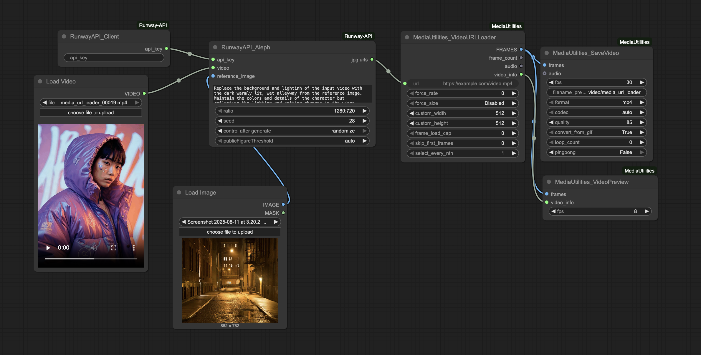

# ComfyUI-RunwayAPI

Custom ComfyUI nodes that call the [Runway API](https://docs.dev.runwayml.com/api/) —specifically the Gen-4 Aleph video_to_video endpoint with optional reference image(s). Use these to send a source video + prompt from ComfyUI, track the task, and return the finished output URL.

---

  

## Installation

### Installing manually

1. Navigate to the `ComfyUI/custom_nodes` directory.

2. Clone this repository:

To be completed.
